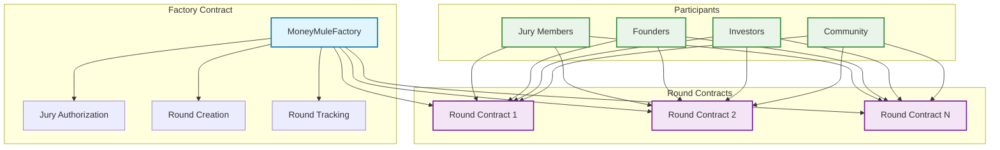
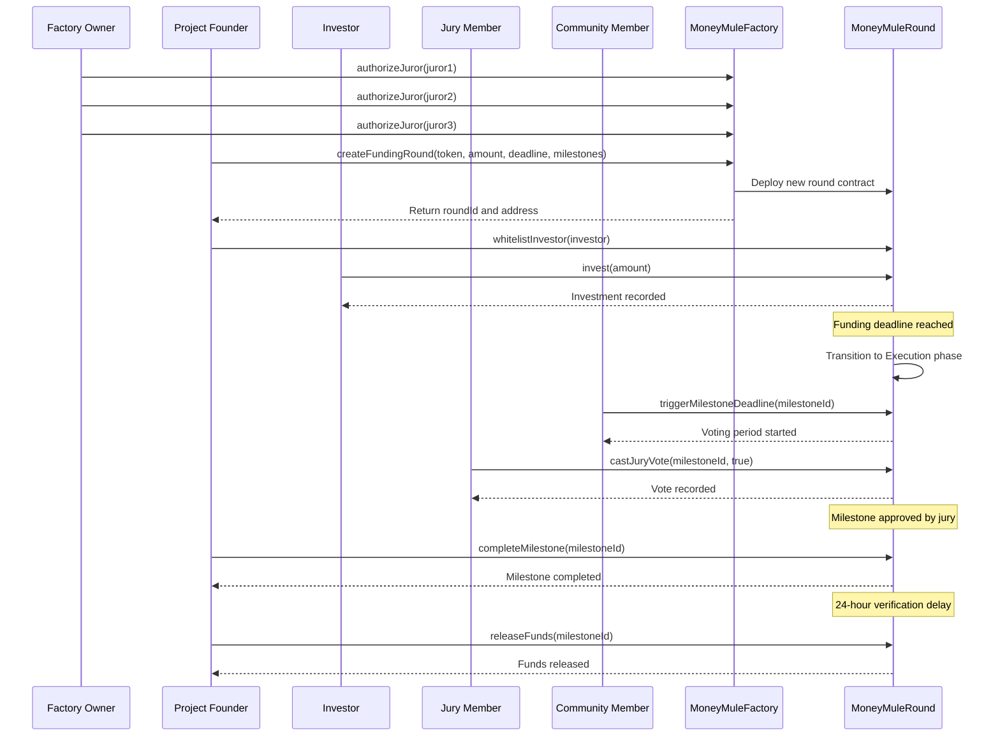

# MoneyMule Smart Contract Documentation


Complete technical documentation for the MoneyMule milestone-based funding platform with jury voting system.

## Overview

**MoneyMule** is a revolutionary Factory + Round architecture that enables secure, milestone-based funding with jury governance. The system ensures accountability, reduces risk, and aligns incentives between founders and investors through a decentralized approval process.

## Architecture



## Key Features

### 🏭 **Factory Pattern**
- **Scalable Deployment**: Create unlimited funding rounds
- **Global Jury Management**: Centralized jury authorization
- **Round Tracking**: Complete visibility of all rounds
- **Gas Optimization**: Efficient contract deployment

### 🗳️ **Jury Governance**
- **Authorized Voting**: Only factory-approved jury members can vote
- **Milestone Approval**: 3-member jury decides milestone completion
- **Community Triggers**: Anyone can activate deadline voting
- **Transparent Process**: All votes are recorded on-chain

### 📊 **Partial Funding**
- **Flexible Thresholds**: Rounds can proceed with partial funding
- **Proportional Release**: Funds released proportionally to funding achieved
- **Investor Protection**: Withdrawal rights for unfunded portions
- **Dynamic Scaling**: Milestone amounts scale with funding level

### 🔒 **Security Features**
- **ReentrancyGuard**: Protection against reentrancy attacks
- **SafeERC20**: Secure token transfers
- **Access Control**: Role-based permissions
- **Emergency Controls**: Pause and cancel mechanisms

## Contract Addresses

### 🌐 Saga Chainlet Deployment
| Contract | Address | Status |
|----------|---------|--------|
| **MoneyMuleFactory** | `0xa1820208Dff37B39a8a324e82E3449283e21703b` | ✅ Active |
| **USDC Token** | `0xA2bE65F0Bfb810eF7B17807F3cd10D428f989A4a` | ✅ Active |

### Network Configuration
```env
SAGA_RPC_URL=https://moneymule-2751721147387000-1.jsonrpc.sagarpc.io
FACTORY_ADDRESS=0xa1820208Dff37B39a8a324e82E3449283e21703b
CHAIN_ID=2751721147387000
```

## Quick Setup

### Prerequisites
```bash
# Install dependencies
npm install

# Compile contracts
npm run compile

# Run tests
npm run test
```

### Environment Configuration
```env
# Required
PRIVATE_KEY=your-private-key-here
FACTORY_ADDRESS=0xa1820208Dff37B39a8a324e82E3449283e21703b

# For demo accounts
PRIVATE_KEY_2=second-account-private-key
PRIVATE_KEY_3=third-account-private-key
PRIVATE_KEY_4=fourth-account-private-key
PRIVATE_KEY_5=fifth-account-private-key
PRIVATE_KEY_6=sixth-account-private-key

# Network
SAGA_RPC_URL=https://moneymule-2751721147387000-1.jsonrpc.sagarpc.io
```

## Deployment Guide

### 1. **Development Deployment**
```bash
# Deploy with demo interactions
npm run deploy:factory

# Run complete lifecycle demo
npm run demo:factory
```

### 2. **Production Deployment**
```bash
# Deploy factory only
npm run deploy:production

# Manage deployed factory
npm run manage:factory
```

### 3. **Local Testing**
```bash
# Start local node
npm run deploy:local

# Deploy locally
npm run deploy:factory:local
```

## Contract Interface

### MoneyMuleFactory

#### Core Functions
```solidity
/**
 * @dev Create a new funding round
 * @param token The ERC20 token address for funding
 * @param targetAmount The total funding target
 * @param fundingDeadline The deadline for funding phase
 * @param milestones Array of milestone data
 * @return roundId The created round ID
 * @return roundContract The deployed round contract address
 */
function createFundingRound(
    address token,
    uint256 targetAmount,
    uint256 fundingDeadline,
    MilestoneData[] calldata milestones
) external returns (uint256 roundId, address roundContract);

/**
 * @dev Authorize a jury member
 * @param juror Address to authorize as jury member
 */
function authorizeJuror(address juror) external;

/**
 * @dev Revoke jury authorization
 * @param juror Address to revoke authorization from
 */
function revokeJuror(address juror) external;
```

#### View Functions
```solidity
function getRoundContract(uint256 roundId) external view returns (address);
function getFounderRounds(address founder) external view returns (uint256[] memory);
function getInvestorRounds(address investor) external view returns (uint256[] memory);
function isAuthorizedJuror(address juror) external view returns (bool);
function getTotalRounds() external view returns (uint256);
function getNextRoundId() external view returns (uint256);
```

### MoneyMuleRound

#### Investment Functions
```solidity
/**
 * @dev Whitelist an investor
 * @param investor Address to whitelist
 */
function whitelistInvestor(address investor) external;

/**
 * @dev Invest in the funding round
 * @param amount Amount to invest
 */
function invest(uint256 amount) external;

/**
 * @dev Withdraw investment
 * @param amount Amount to withdraw (0 = withdraw all available)
 */
function withdrawInvestment(uint256 amount) external;
```

#### Milestone Functions
```solidity
/**
 * @dev Trigger milestone deadline voting
 * @param milestoneId The milestone ID to trigger
 */
function triggerMilestoneDeadline(uint256 milestoneId) external;

/**
 * @dev Cast jury vote on milestone
 * @param milestoneId The milestone ID
 * @param approve Whether to approve the milestone
 */
function castJuryVote(uint256 milestoneId, bool approve) external;

/**
 * @dev Complete an approved milestone
 * @param milestoneId The milestone ID to complete
 */
function completeMilestone(uint256 milestoneId) external;

/**
 * @dev Release funds after verification delay
 * @param milestoneId The milestone ID to release funds for
 */
function releaseFunds(uint256 milestoneId) external;
```

#### View Functions
```solidity
function getRoundInfo() external view returns (
    address founderAddr,
    address tokenAddr,
    uint256 target,
    uint256 current,
    uint256 deadline,
    RoundPhase currentPhase,
    uint256 totalMilestones
);

function getMilestoneInfo(uint256 milestoneId) external view returns (
    string memory description,
    uint256 fundingAmount,
    uint256 deadline,
    MilestoneStatus status,
    uint256 votesFor,
    uint256 votesAgainst
);

function getWithdrawableAmount(address investor) external view returns (uint256);
```

## System Flow



## Usage Examples

### Creating a Funding Round

```typescript
import { ethers } from "ethers";

// Connect to factory
const factory = new ethers.Contract(
  "0xa1820208Dff37B39a8a324e82E3449283e21703b",
  MoneyMuleFactoryABI,
  signer
);

// Define milestones
const milestones = [
  {
    description: "MVP Development",
    fundingAmount: ethers.parseEther("40"),
    deadline: Math.floor(Date.now() / 1000) + 86400, // 24 hours from now
    juryWallets: [juror1, juror2, juror3]
  },
  {
    description: "Beta Testing",
    fundingAmount: ethers.parseEther("60"),
    deadline: Math.floor(Date.now() / 1000) + 172800, // 48 hours from now
    juryWallets: [juror1, juror2, juror3]
  }
];

// Create funding round
const tx = await factory.createFundingRound(
  tokenAddress,
  ethers.parseEther("100"),
  Math.floor(Date.now() / 1000) + 86400, // Funding deadline
  milestones
);

const receipt = await tx.wait();
// Parse RoundCreated event to get roundId and roundContract
```

### Investing in a Round

```typescript
// Connect to round contract
const round = new ethers.Contract(roundAddress, MoneyMuleRoundABI, signer);

// Whitelist investor (done by founder)
await round.whitelistInvestor(investorAddress);

// Approve tokens and invest
await token.approve(roundAddress, ethers.parseEther("25"));
await round.invest(ethers.parseEther("25"));
```

### Jury Voting Process

```typescript
// Trigger milestone deadline (can be done by anyone)
await round.triggerMilestoneDeadline(1);

// Cast jury votes (only authorized jury members)
await round.connect(juror1).castJuryVote(1, true);  // Approve
await round.connect(juror2).castJuryVote(1, true);  // Approve
await round.connect(juror3).castJuryVote(1, false); // Reject

// Result: Milestone approved (2 out of 3 votes)
```

### Completing Milestones

```typescript
// Complete milestone (only founder, after jury approval)
await round.completeMilestone(1);

// Wait for verification delay (24 hours)
// Then release funds
await round.releaseFunds(1);
```

## Constants and Parameters

### Time Constants
```solidity
uint256 public constant VOTING_PERIOD = 7 days;
uint256 public constant VERIFICATION_DELAY = 24 hours;
```

### Phase Enums
```solidity
enum RoundPhase { 
    Funding,    // 0: Accepting investments
    Execution,  // 1: Milestone execution
    Completed,  // 2: All milestones completed
    Cancelled   // 3: Round cancelled
}

enum MilestoneStatus { 
    Pending,    // 0: Not yet triggered
    Active,     // 1: Voting in progress
    Approved,   // 2: Approved by jury
    Rejected,   // 3: Rejected by jury
    Completed   // 4: Completed and funds released
}
```

## Events

### Factory Events
```solidity
event RoundCreated(
    uint256 indexed roundId,
    address indexed roundContract,
    address indexed founder,
    address token,
    uint256 targetAmount
);

event JurorAuthorized(address indexed juror);
event JurorRevoked(address indexed juror);
```

### Round Events
```solidity
event InvestorWhitelisted(address indexed investor);
event InvestmentMade(address indexed investor, uint256 amount);
event PhaseChanged(RoundPhase newPhase);
event MilestoneDeadlineTriggered(uint256 indexed milestoneId, address indexed triggeredBy);
event JuryVoteCast(uint256 indexed milestoneId, address indexed juror, bool approve);
event MilestoneVotingFinalized(uint256 indexed milestoneId, MilestoneStatus result);
event MilestoneCompleted(uint256 indexed milestoneId);
event FundsReleased(uint256 indexed milestoneId, uint256 amount);
event InvestmentWithdrawn(address indexed investor, uint256 amount);
event RoundCancelled();
```

## Security Considerations

### Built-in Security
- **ReentrancyGuard**: All state-changing functions protected
- **SafeERC20**: Secure token transfers with failure handling
- **Access Control**: Role-based permissions for all operations
- **Input Validation**: Comprehensive parameter validation
- **Emergency Controls**: Owner can pause factory operations

### Best Practices
1. **Multi-signature Wallets**: Use multisig for factory ownership
2. **Jury Selection**: Carefully vet jury members before authorization
3. **Testing**: Thoroughly test on testnet before mainnet deployment
4. **Monitoring**: Monitor contract events for suspicious activity
5. **Upgrades**: Consider proxy patterns for future upgrades

## Testing

### Test Coverage
The contract suite includes comprehensive tests covering:

- **Factory Management**: Jury authorization, round creation, tracking
- **Investment Flow**: Whitelisting, investing, withdrawal scenarios
- **Milestone Execution**: Triggering, voting, completion, fund release
- **Security**: Access control, reentrancy protection, edge cases
- **Integration**: Complete end-to-end lifecycle scenarios

### Running Tests
```bash
# Run all tests
npm run test

# Run specific test file
npx hardhat test test/MoneyMuleFactory.ts

# Run with coverage
npm run test:coverage
```

## Troubleshooting

### Common Issues

#### **Investment Fails**
- Check investor is whitelisted: `await round.whitelist(investor)`
- Verify funding phase: `await round.phase()` should be 0
- Confirm token approval: `await token.allowance(investor, roundAddress)`

#### **Jury Vote Fails**
- Verify jury authorization: `await factory.isAuthorizedJuror(juror)`
- Check milestone is active: `await round.getMilestoneInfo(milestoneId)`
- Confirm juror hasn't voted: Check `hasVoted` mapping

#### **Milestone Completion Fails**
- Verify milestone is approved: Status should be 2 (Approved)
- Check caller is founder: `await round.founder()`
- Ensure milestone deadline has passed

### Error Messages
```solidity
"Invalid token address"
"Target amount must be greater than 0"
"Funding deadline must be in the future"
"At least one milestone required"
"Milestone deadline must be after funding deadline"
"Jury wallet not authorized"
"Milestone funding must equal target amount"
"Not whitelisted"
"Funding phase ended"
"Milestone not active"
"Already voted"
"Not authorized juror"
"Milestone not approved"
"Verification delay not passed"
```

## Integration Guide

### Frontend Integration
```typescript
// React hook for contract interaction
import { useContract, useProvider } from 'wagmi';
import { MoneyMuleFactoryABI } from './abis';

const useMoneyMuleFactory = () => {
  const contract = useContract({
    address: '0xa1820208Dff37B39a8a324e82E3449283e21703b',
    abi: MoneyMuleFactoryABI,
    signerOrProvider: useProvider(),
  });

  const createRound = async (roundData) => {
    return await contract.createFundingRound(
      roundData.token,
      roundData.targetAmount,
      roundData.fundingDeadline,
      roundData.milestones
    );
  };

  const getRounds = async (founder) => {
    return await contract.getFounderRounds(founder);
  };

  return { createRound, getRounds };
};
```

### Backend Integration
```typescript
// Express.js API endpoint
app.post('/api/rounds', async (req, res) => {
  try {
    const { token, targetAmount, fundingDeadline, milestones } = req.body;
    
    const tx = await factory.createFundingRound(
      token,
      targetAmount,
      fundingDeadline,
      milestones
    );
    
    const receipt = await tx.wait();
    
    // Parse events and store in database
    const roundCreatedEvent = receipt.events?.find(
      e => e.event === 'RoundCreated'
    );
    
    if (roundCreatedEvent) {
      await saveRoundToDatabase({
        roundId: roundCreatedEvent.args.roundId,
        roundContract: roundCreatedEvent.args.roundContract,
        founder: roundCreatedEvent.args.founder,
        token: roundCreatedEvent.args.token,
        targetAmount: roundCreatedEvent.args.targetAmount,
      });
    }
    
    res.json({ success: true, receipt });
  } catch (error) {
    res.status(500).json({ error: error.message });
  }
});
```

## Support

For technical support or questions regarding the MoneyMule smart contract system:

1. **Documentation**: Reference this guide and inline contract comments
2. **Testing**: Use the comprehensive test suite for implementation examples
3. **Community**: Join discussions in the project repository
4. **Issues**: Report bugs or feature requests through GitHub issues

## License

This project is licensed under the MIT License - see the LICENSE file for details.
