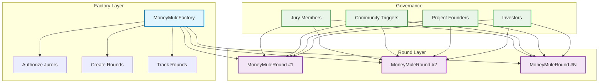
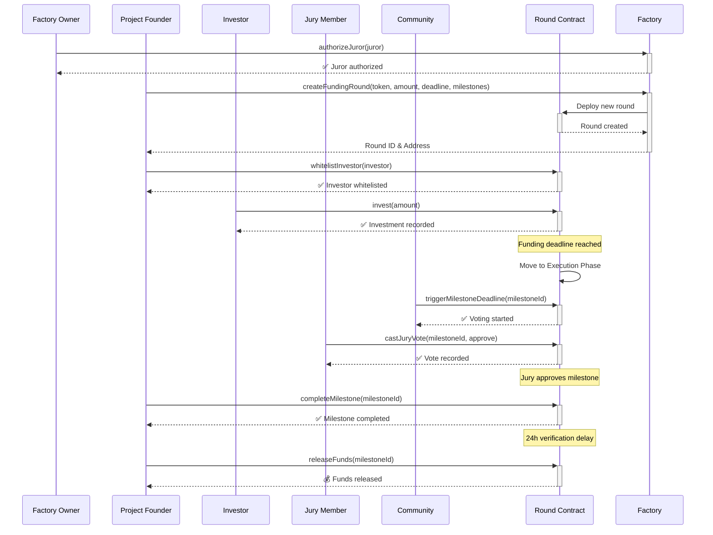
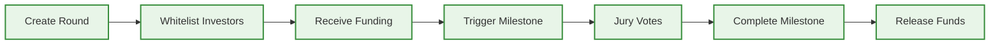
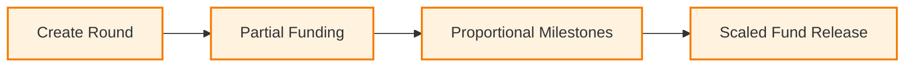
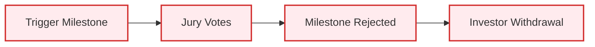

# MoneyMule Smart Contracts 🎯


A milestone-based funding platform with jury voting system for early-stage projects. Built with Factory Pattern for scalability and advanced governance features.

## 🏗️ MoneyMule Ecosystem

| Repository | Description | Status |
|------------|-------------|--------|
| **[Frontend](https://github.com/TomasDmArg/money-mule)** | Next.js web application with React & Material-UI | ✅ Active |
| **[Backend](https://github.com/TomasDmArg/money-mule-backend)** | AI Multiagent system for deck and document analysis | ✅ Active |
| **[Smart Contracts](https://github.com/TomasDmArg/money-mule-contracts)** | Solidity contracts with Hardhat & TypeScript | ✅ Active |

## 🌟 Overview

MoneyMule revolutionizes early-stage project funding by implementing a milestone-based approach where investors commit funds that are only released when specific project milestones are approved by an authorized jury. This system ensures accountability, reduces risk, and enables partial funding with community governance.

## 🏗️ Architecture



## 🎯 System Flow



## ✨ Key Features

### 🎯 **Funding & Governance**
- **📊 Partial Funding**: Rounds can proceed with partial funding
- **🗳️ Jury Voting**: 3 authorized wallets decide milestone approval
- **⏰ Deadline System**: Specific deadlines per milestone
- **🚫 Restricted Voting**: Only jury can vote (not founders/investors)
- **🔄 Community Triggers**: Anyone can activate deadline voting

### 🔐 **Security & Controls**
- **🏭 Factory Pattern**: Scalable and gas-optimized deployment
- **🛡️ Security First**: ReentrancyGuard, SafeERC20, comprehensive validations
- **🚨 Emergency Features**: Pause, cancel, withdrawal protections
- **💰 Proportional Release**: Funds released proportionally to funding achieved

### 💡 **User Experience**
- **👥 Whitelist System**: Founder-controlled investor access
- **🔄 Multiple Rounds**: Independent rounds per project
- **📈 Transparent Tracking**: Full visibility of funding and milestones
- **⚡ Automatic Transitions**: Smart phase management

## 🚀 Quick Start

```bash
# Clone and setup
git clone https://github.com/TomasDmArg/money-mule-contracts.git
cd money-mule-contracts
npm install

# Compile contracts
npm run compile

# Run tests
npm run test

# Deploy demo system
npm run deploy:factory
```

## 📦 Deployed Contracts

### 🏭 Factory System
| Contract | Address | Network |
|----------|---------|---------|
| **MoneyMuleFactory** | `0xa1820208Dff37B39a8a324e82E3449283e21703b` | Saga Chainlet |
| **USDC Token** | `0xA2bE65F0Bfb810eF7B17807F3cd10D428f989A4a` | Saga Chainlet |

### 🌐 Network Details
| Parameter | Value |
|-----------|-------|
| **Chain ID** | 2751721147387000 |
| **RPC URL** | https://moneymule-2751721147387000-1.jsonrpc.sagarpc.io |
| **Explorer** | https://moneymule-2751721147387000-1.sagaexplorer.io |

## 📚 Documentation

### 📖 Detailed Guides
- **[📋 Smart Contract Documentation](.docs/MoneyMule.md)** - Complete technical documentation
- **[🪙 USDC Token Guide](.docs/USDC.md)** - Token deployment and configuration

## 🎯 Core Workflow

### 1. **Setup Phase**
```typescript
// Factory owner authorizes jurors
await factory.authorizeJuror(juror1.address);
await factory.authorizeJuror(juror2.address);
await factory.authorizeJuror(juror3.address);
```

### 2. **Round Creation**
```typescript
// Founder creates funding round
const milestones = [{
  description: "MVP Development",
  fundingAmount: ethers.parseEther("40"),
  deadline: fundingDeadline + 86400,
  juryWallets: [juror1, juror2, juror3]
}];

const [roundId, roundContract] = await factory.createFundingRound(
  tokenAddress,
  ethers.parseEther("100"),
  fundingDeadline,
  milestones
);
```

### 3. **Investment Phase**
```typescript
// Founder whitelists investors
await round.whitelistInvestor(investor.address);

// Investors contribute funds
await round.invest(ethers.parseEther("50"));
```

### 4. **Milestone Execution**
```typescript
// Community triggers milestone deadline
await round.triggerMilestoneDeadline(1);

// Jury votes on milestone completion
await round.castJuryVote(1, true);  // Approve

// Founder completes milestone
await round.completeMilestone(1);

// Funds released after verification delay
await round.releaseFunds(1);
```

## 🧪 Testing

### **Test Suite**
```bash
# Run all tests
npm run test

# Run with coverage
npm run test:coverage

# Clean and rebuild
npm run clean && npm run compile
```

### **Test Coverage**
- ✅ Factory management & juror authorization
- ✅ Round creation & validation
- ✅ Funding phase & investor whitelisting
- ✅ Jury voting system & deadline triggers
- ✅ Milestone completion & fund release
- ✅ Investment withdrawal & edge cases
- ✅ Complete lifecycle integration tests

## 🚀 Deployment Scripts

### **Available Scripts**
```bash
# 🏭 Factory Deployment
npm run deploy:factory          # Full demo deployment
npm run deploy:production       # Production deployment
npm run manage:factory          # Post-deployment management

# 🎬 Demo & Testing
npm run demo:factory           # Complete lifecycle demo
npm run demo:factory:local     # Local demo

# 🪙 USDC Token
npm run deploy:usdc            # Deploy USDC token
npm run mint:usdc              # Mint USDC tokens
```

### **Environment Setup**
```env
# Required
PRIVATE_KEY=your-private-key-here
FACTORY_ADDRESS=0xa1820208Dff37B39a8a324e82E3449283e21703b

# For demo accounts
PRIVATE_KEY_2=second-account-private-key
PRIVATE_KEY_3=third-account-private-key

# Network configuration
SAGA_RPC_URL=https://moneymule-2751721147387000-1.jsonrpc.sagarpc.io
```

## 📋 Smart Contract API

### **MoneyMuleFactory**
```solidity
// Core Functions
function createFundingRound(
    address token,
    uint256 targetAmount,
    uint256 fundingDeadline,
    MilestoneData[] calldata milestones
) external returns (uint256 roundId, address roundContract);

function authorizeJuror(address juror) external;
function revokeJuror(address juror) external;

// View Functions
function getRoundContract(uint256 roundId) external view returns (address);
function getFounderRounds(address founder) external view returns (uint256[] memory);
function isAuthorizedJuror(address juror) external view returns (bool);
```

### **MoneyMuleRound**
```solidity
// Investment Functions
function whitelistInvestor(address investor) external;
function invest(uint256 amount) external;
function withdrawInvestment(uint256 amount) external;

// Milestone Functions
function triggerMilestoneDeadline(uint256 milestoneId) external;
function castJuryVote(uint256 milestoneId, bool approve) external;
function completeMilestone(uint256 milestoneId) external;
function releaseFunds(uint256 milestoneId) external;
```

## 🔒 Security Features

### **Built-in Protections**
- **🛡️ Reentrancy Guard**: All critical functions protected
- **🔐 Access Control**: Role-based permissions with validation
- **✅ Input Validation**: Comprehensive parameter checking
- **🚨 Emergency Controls**: Pause, cancel, emergency recovery
- **💎 Safe Transfers**: OpenZeppelin SafeERC20 implementation

### **Governance Security**
- **🎯 Voting Isolation**: Only authorized jury members can vote
- **⏰ Time Controls**: Deadlines and verification delays
- **🔄 Transparent Process**: All actions emit comprehensive events
- **💰 Fund Protection**: Multiple withdrawal conditions and safeguards

## 🎮 Demo Scenarios

### **Successful Funding**


### **Partial Funding**


### **Milestone Rejection**


## 🏆 Built For ETH Global Cannes 2025

### **Tech Stack**
- **🔨 Hardhat 3**: Development framework
- **🛡️ OpenZeppelin**: Security standards
- **⚡ Ethers.js v6**: Ethereum library
- **🌐 Saga Chainlet**: Deployment network
- **📝 TypeScript**: Type safety

### **Innovation Highlights**
- **🏭 Factory Pattern**: Scalable round deployment
- **⚖️ Jury Governance**: Decentralized milestone approval
- **📊 Partial Funding**: Flexible funding thresholds
- **🔄 Community Triggers**: Permissionless deadline activation

## 🤝 Contributing

1. Fork the repository
2. Create feature branch (`git checkout -b feature/amazing-feature`)
3. Commit changes (`git commit -m 'Add amazing feature'`)
4. Push to branch (`git push origin feature/amazing-feature`)
5. Open Pull Request

## 📄 License

This project is licensed under the MIT License - see the [LICENSE](LICENSE) file for details.

---

### 📋 Key Principles

1. **💰 Funding Restriction**: Only invest during funding phase
2. **🗳️ Voting Restriction**: Only authorized jury votes
3. **⏰ Community Trigger**: Anyone can activate deadline voting
4. **💎 Proportional Release**: Funds released proportionally to funding achieved
5. **🚨 Emergency Safety**: Owner controls for critical situations

**🎉 Complete milestone-based funding with jury governance!**
